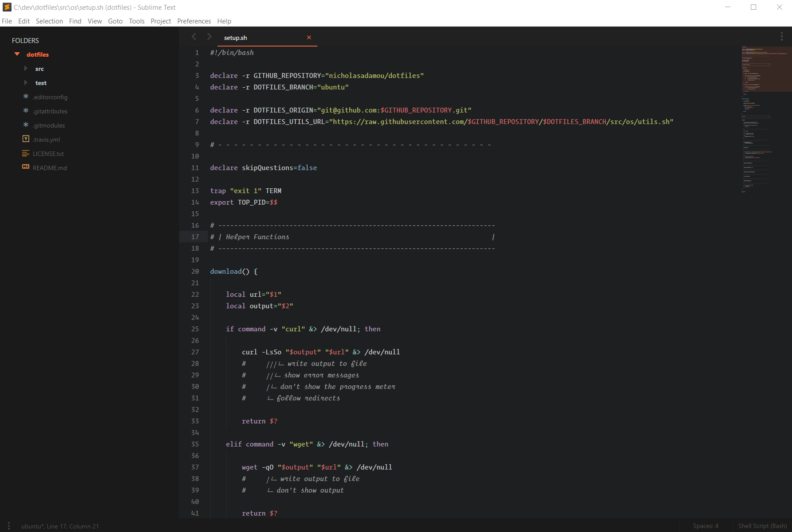

# Sublime Text Setup

This document describes how I set up my text editor that I use to develop the tools on my Github page.

If you have any comments or suggestions, feel free to give me a shout [on Twitter](https://twitter.com/nicholasadamou)!

## Setup

To setup Sublime Text to look like what is seen in the above image do the following:

1. Install [package Control](https://sublime.wbond.net/installation),  [PackageSync](https://packagecontrol.io/packages/PackageSync)
2. Confiure `PackageSync` to use [SublimePackagesBackup.zip](SublimePackagesBackup.zip)

## Getting Started

- [Sublime Text](http://www.sublimetext.com/) - the best text editor for me. I've been using it for years. 
- [Package Control](https://sublime.wbond.net/installation) - essential package manager for Sublime Text.
- [Unofficial Documentation](http://docs.sublimetext.info/en/latest/index.html)

## Tools (Better Sublime Text) 

- [Advanced New File](https://github.com/skuroda/Sublime-AdvancedNewFile) - This plugin allows for faster file creation within a project.
- [SideBarEnhancements](https://packagecontrol.io/packages/SideBarEnhancements) - Provides the basics operations of files and folders : new file/folder, edit, open/run, reveal, find in selected/parent/project, cut, copy, paste, rename, move, delete.
- [Terminal](https://packagecontrol.io/packages/Terminal) - Launch terminals from the current file or the root project folder
- [Open Folder](https://packagecontrol.io/packages/Open%20Folder) - SublimeText plugin to add a Side Bar context menu option to open folders
- [EditorConfig](https://packagecontrol.io/packages/EditorConfig) - [EditorConfig](http://editorconfig.org/) helps developers maintain consistent coding styles between different editors
- [SublimeCodeIntel](https://packagecontrol.io/packages/SublimeCodeIntel) - Full-featured code intelligence and smart autocomplete engine.
- [Alignment](https://packagecontrol.io/packages/Alignment) - Easy alignment of multiple selections and multi-line selections
- [AlignTab](https://packagecontrol.io/packages/AlignTab) - An alignment plugin using regular expression.

## Language Specific Packages

### HTML & CSS

#### Essentials

- [Emmet](https://sublime.wbond.net/packages/Emmet) - an essential toolkit of web developers working with HTML/CSS 
- [ColorHighlighter](https://packagecontrol.io/packages/Color%20Highlighter) - ColorHighlighter - is a plugin for the Sublime text 2 and 3, which underlays selected hexadecimal colorcodes (works with SASS).
- [HTML5](https://sublime.wbond.net/packages/HTML5) - HTML5 snippets/syntax
- [HTML5 Boilerplate](https://sublime.wbond.net/packages/HTML%20Boilerplate) - snippet to generate HTML5 Boilerplate
- [CSS3](https://sublime.wbond.net/packages/CSS3) - CSS3 syntax, autocomplete

#### HTML Preprocessors/Templating

- [Pug](https://sublime.wbond.net/packages/Pug) - syntax for Pug

#### CSS Preprocessors

- [SASS](https://sublime.wbond.net/packages/Sass) - syntax support for Sass and SCSS
- [SCSS](https://sublime.wbond.net/packages/SCSS) - official SCSS bundle
- [SASS Snippets](https://sublime.wbond.net/packages/SASS%20Snippets) - snippets for SASS
- [SCSS Snippets](https://sublime.wbond.net/packages/SCSS%20Snippets) Snippets for SCSS

#### Beautify Code

- [HTML-CSS-JS-Prettify](https://sublime.wbond.net/packages/HTML-CSS-JS%20Prettify) - prettifies HTML, CSS and JS

#### Workflow

- [Gulp](https://sublime.wbond.net/packages/Gulp) Gulp task runner in Sublime Text
- [Bower](https://sublime.wbond.net/packages/Bower) install bower packages from Sublime Text

#### Compatibility

- [Can I Use](https://sublime.wbond.net/packages/Can%20I%20Use) - checks CSS property support with [Can I Use](http://caniuse.com/)

### Javascript

#### Essentials

- [Javascript Snippets](https://sublime.wbond.net/packages/JavaScript%20Snippets)
- [NodeJS](https://sublime.wbond.net/packages/Nodejs) - snippets and code completion for Node.js
- [Babel](https://packagecontrol.io/packages/Babel) - Syntax definitions for ES6 JavaScript with React JSX extensions.

#### Formaters

- [JSCS](https://packagecontrol.io/packages/JSCS-Formatter) - Autoformat your JavaScript code with the js syntax guide that you want.

#### Preprocessors

- [Coffeescript](https://sublime.wbond.net/packages/CoffeeScript) - syntax and snippets for Coffeescript
- [Typescript](https://sublime.wbond.net/packages/TypeScript) - syntax for Typescript

#### Frameworks

- [jQuery](https://sublime.wbond.net/packages/jQuery) - autocomplete, snippets, and syntax for jQuery
- [jQuery Mobile Snippets](https://sublime.wbond.net/packages/jQuery%20Mobile%20Snippets) - snippets for jQuery Mobile

### Markdown

#### Syntax Highlighting

- [Markdown​Editing](https://packagecontrol.io/packages/MarkdownEditing) - Powerful Markdown package for Sublime Text with better syntax understanding and good color schemes.
- [Markdown Extended](https://packagecontrol.io/packages/Markdown%20Extended) - Markdown syntax highlighter for Sublime Text, with extended support for GFM fenced code blocks, with language-specific syntax highlighting.

## Linters

### SublimeLinter

Full list of SublimeLinters, right [here](https://sublime.wbond.net/browse/labels/SublimeLinter).

- [SublimeLinter](https://sublime.wbond.net/packages/SublimeLinter) - the most extensive Sublime Text linter out there
- [SublimeLinter-jshint](https://sublime.wbond.net/packages/SublimeLinter-jshint) - Javascript Linter
- [SublimeLinter-html-tidy](https://sublime.wbond.net/packages/SublimeLinter-html-tidy) - HTML Linter
- [SublimeLinter-csslint](https://sublime.wbond.net/packages/SublimeLinter-csslint) - CSS Linter
- [SublimeLinter-json](https://sublime.wbond.net/packages/SublimeLinter-json) - JSON Linter

## Version Control

- [Git](https://sublime.wbond.net/packages/Git) - git integration into Sublime Text
- [GitGutter](https://sublime.wbond.net/packages/GitGutter) - see git diffs in gutter
- [Git Status Bar](https://packagecontrol.io/packages/GitStatusBar) - A more compact Git StatusBar
- [GitSavvy](https://packagecontrol.io/packages/GitSavvy) - Full git and GitHub integration with Sublime Text 3.
- [Github Tools](https://sublime.wbond.net/packages/Github%20Tools) - tools to work with Github in Sublime Text

## UI 

### Fonts

- [Operator Mono](https://www.typography.com/fonts/operator/styles/) - The $200 holy-grail of fonts for developers.

### Themes

- [Material Theme](https://packagecontrol.io/packages/Material%20Theme) - Material Theme, the most epic theme for Sublime Text 3 by Mattia Astorino

### Color Schemes

- [Tomorrow Night Italics](https://packagecontrol.io/packages/Tomorrow%20Night%20Italics%20Color%20Scheme) - Tomorrow Night Color Schemes for SublimeText 3, with Italics on comments!

### Misc.

- [A File Icon](https://packagecontrol.io/packages/A%20File%20Icon) - Sublime Text File-Specific Icons for Improved Visual Grepping

#### Color Scheme/Theme Utilities

- [tmTheme Editor](http://tmtheme-editor.herokuapp.com/) - allows you to make your own Sublime color schemes
- [ColorSublime](http://colorsublime.com/) - a website featuring a wide variety of Sublime color schemes
- [Schemr](https://sublime.wbond.net/packages/Schemr) - a package that allows you to switch between color schemes faster
- [themr](https://packagecontrol.io/packages/Themr) - a package that allows you to switch between themes faster

## Learning Resources

- [Sublime Text Tutorials by Scotch.io](https://scotch.io/tag/sublime-text) - Here you can find a lot of stuff, videos, tutorials, plugins, themes and others about Sublime Text. 